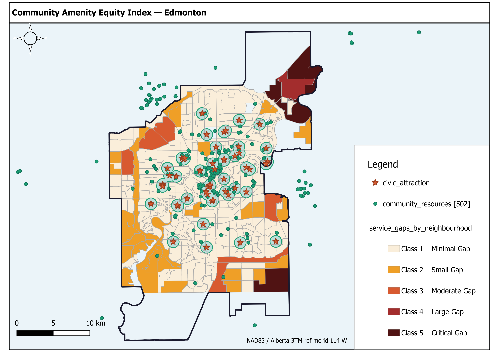

# Service Gap & Coverage Analysis — Edmonton, Alberta

**Project file:** `service_gap_coverage_analysis.qgz`
**CRS:** EPSG:3776 — NAD83(CSRS) / Alberta 3TM ref merid 114 W (projected, metres)
**Date created:** May 2026
**Author:** Martins

---

## Objective

Identify areas of Edmonton that fall outside walkable access to any civic attraction. A walkable radius of **800 metres** is applied as a standard pedestrian threshold (~10-minute walk). The analysis intersects uncovered zones with neighbourhood boundaries to attribute gaps to specific communities and support prioritisation of future service investments.

---

## Input Layers

| Layer | Type | Features | Source |
|---|---|---|---|
| `civic_attraction` | Point | 56 | Original project dataset |
| `community_resources` | Point | 502 | Original project dataset |
| `edmonton_neighbourhoods` | Polygon | 400 | Original project dataset |
| `city_boundary` | Polygon | 1 | Original project dataset |

All input layers are in EPSG:3776 (projected, units = metres).

---

## Methodology

The workflow follows a five-step spatial overlay sequence:

### Step 1 — Buffer (800 m)
**Algorithm:** `native:buffer`
Each of the 56 civic attractions is buffered by 800 metres (non-dissolved) to represent individual walkable service zones.

- **Input:** `civic_attraction`
- **Output:** `civic_attraction_buffer_800m.gpkg`
- **Parameters:** Distance = 800 m, Segments = 32, End cap = Round, Dissolve = False

### Step 2 — Dissolve
**Algorithm:** `native:dissolve`
Individual buffers are merged into a single unified coverage polygon. Overlapping buffers are unioned so the result represents the total area served by at least one civic attraction within 800 m.

- **Input:** `civic_attraction_buffer_800m.gpkg`
- **Output:** `civic_coverage_dissolved.gpkg`
- **Result:** 1 dissolved polygon representing total covered area

### Step 3 — Difference (Raw Gap)
**Algorithm:** `native:difference`
The dissolved coverage polygon is subtracted from the city boundary. The remainder is the portion of Edmonton with no civic attraction within 800 m.

- **Input:** `city_boundary` minus `civic_coverage_dissolved.gpkg`
- **Output:** `service_gaps_raw.gpkg`
- **Interpretation:** Any land within this output is a service gap

### Step 4 — Intersection (Neighbourhood-attributed Gaps)
**Algorithm:** `native:intersection`
The raw gap geometry is intersected with `edmonton_neighbourhoods`. This splits the gap into fragments corresponding to individual neighbourhood boundaries, and inherits neighbourhood attributes (name, ID, etc.) from the neighbourhood layer.

- **Input:** `service_gaps_raw.gpkg` x `edmonton_neighbourhoods`
- **Output:** `service_gaps_by_neighbourhood.gpkg`
- **Result:** 400 features — one gap fragment per neighbourhood (features with no gap geometry will have zero/null area)

### Step 5 — Gap Area Calculation
**Algorithm:** `native:fieldcalculator`
A `gap_area_m2` field (float, 2 decimal places) is calculated using `$area` for each neighbourhood gap fragment.

- **Input:** `service_gaps_by_neighbourhood.gpkg`
- **Output:** `service_gaps_by_neighbourhood_area.gpkg`

### Step 6 — Community Resource Count per Neighbourhood
**Algorithm:** `native:countpointsinpolygon`
The 502 community resources are counted within each neighbourhood polygon as a contextual measure of existing support infrastructure.

- **Input:** `community_resources` (points), `edmonton_neighbourhoods` (polygons)
- **Output:** `neighbourhoods_resource_count.gpkg`
- **Field added:** `resource_count`

---

## Output Layers

| File | Description | Key Fields |
|---|---|---|
| `civic_attraction_buffer_800m.gpkg` | 800 m buffer around each civic attraction | Inherits civic attraction attributes |
| `civic_coverage_dissolved.gpkg` | Unified coverage zone (all buffers merged) | Single polygon |
| `service_gaps_raw.gpkg` | City area outside all 800 m buffers | Single polygon |
| `service_gaps_by_neighbourhood_area.gpkg` | Gap fragments attributed to neighbourhoods | `gap_area_m2` + neighbourhood fields |
| `neighbourhoods_resource_count.gpkg` | Neighbourhoods enriched with resource counts | `resource_count` |

---

## QGIS Project

**File:** `service_gap_coverage_analysis.qgz`

All input and output layers are loaded and linked via relative paths. The project is fully portable — copy the entire folder to another machine and open the `.qgz` file.

**Layer load order (suggested rendering, top to bottom):**
1. `civic_attraction` — points on top
2. `community_resources` — points
3. `service_gaps_by_neighbourhood` — gap polygons (red/orange fill, semi-transparent)
4. `civic_attraction_buffer_800m` — individual buffers (blue outline, no fill)
5. `civic_coverage_dissolved` — total coverage (green fill, low opacity)
6. `edmonton_neighbourhoods` — grey outline, no fill
7. `city_boundary` — bold outline

---

## Suggested Symbology

| Layer | Style |
|---|---|
| `civic_coverage_dissolved` | Green fill, 30% opacity — "areas served" |
| `service_gaps_by_neighbourhood_area` | Red/orange graduated on `gap_area_m2` — larger gap = darker colour |
| `civic_attraction_buffer_800m` | Blue outline only, 50% opacity |
| `neighbourhoods_resource_count` | Graduated on `resource_count` (optional context layer) |

---

## Interpretation Notes

- A neighbourhood appearing in `service_gaps_by_neighbourhood_area` with a large `gap_area_m2` value is a **high-priority gap** — significant land area has no civic attraction within walkable distance.
- Cross-referencing with `resource_count` from `neighbourhoods_resource_count` reveals whether a neighbourhood with a civic access gap also lacks community resources — this double deficit identifies the most underserved communities.
- The 800 m threshold is conservative for flat urban terrain. For Edmonton's winter conditions or mobility-limited populations, consider rerunning with 500 m or 400 m radii.
- This analysis does not account for road network routing. Straight-line (Euclidean) buffers may overestimate real walkable access where barriers (highways, rivers, rail) exist.

---

## Possible Extensions

1. **Network-based service areas** — Replace Euclidean buffers with road-network service areas using OpenStreetMap road data for Edmonton.
2. **Multi-threshold analysis** — Run buffers at 400 m, 800 m, and 1,200 m to produce tiered coverage maps.
3. **Weighted gap scoring** — Multiply `gap_area_m2` by neighbourhood population (if available) to produce a population-weighted priority index.
4. **Temporal comparison** — If historic civic attraction datasets are available, repeat the analysis for prior years to track coverage improvement or regression over time.
5. **Facility type breakdown** — If `civic_attraction` includes a type/category field, run the buffer + difference workflow per category (e.g. parks vs. libraries vs. community halls) to identify type-specific gaps.

---

## Reproducibility

All processing steps use native QGIS algorithms with no external dependencies. To reproduce from scratch:

```
1. Load the four original input layers into a QGIS project with CRS EPSG:3776
2. Run native:buffer on civic_attraction -> civic_attraction_buffer_800m.gpkg
3. Run native:dissolve on step 2 output -> civic_coverage_dissolved.gpkg
4. Run native:difference (city_boundary minus step 3) -> service_gaps_raw.gpkg
5. Run native:intersection (step 4 x edmonton_neighbourhoods) -> service_gaps_by_neighbourhood.gpkg
6. Run native:fieldcalculator ($area) on step 5 -> service_gaps_by_neighbourhood_area.gpkg
7. Run native:countpointsinpolygon (community_resources in edmonton_neighbourhoods) -> neighbourhoods_resource_count.gpkg
```

No manual edits were made to any layer at any stage.

---

## Map Preview



